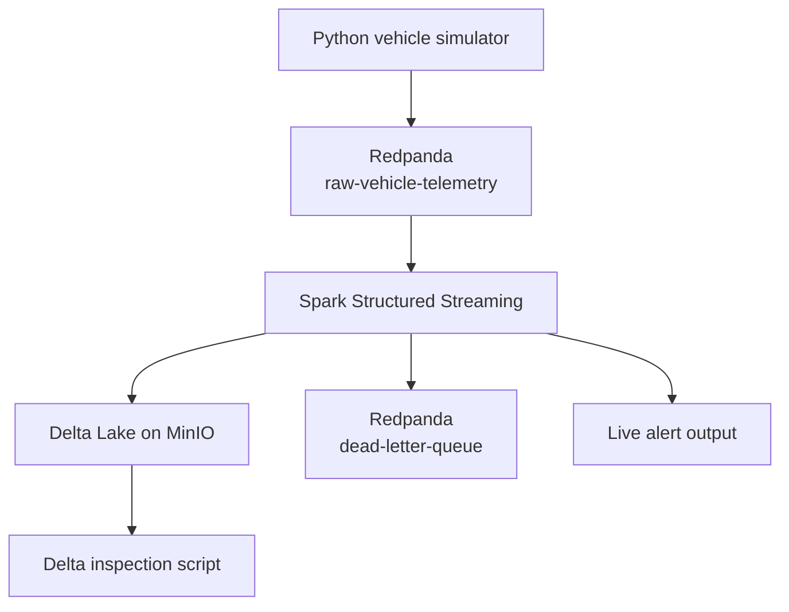

# Autonomous Vehicle Telemetry Pipeline

A local real-time ingestion and processing pipeline built with Python,
Redpanda's Kafka-compatible API, Spark Structured Streaming, Delta Lake,
Docker Compose, and MinIO.

The project simulates autonomous-vehicle telemetry, buffers events in a
partitioned broker, validates and enriches them in a streaming job, routes
malformed records to a dead-letter topic, and persists valid telemetry as a
queryable Delta Lake table.

## Architecture



## Data path

| Stage | Responsibility |
|---|---|
| `producer/simulator.py` | Produces five simulated vehicle streams as keyed JSON events |
| Redpanda | Buffers and partitions the `raw-vehicle-telemetry` topic |
| `consumer/spark_stream.py` | Parses the schema, splits valid/invalid events, and applies alert rules |
| MinIO + Delta Lake | Stores valid, enriched telemetry at `s3a://lakehouse/telemetry` |
| `dead-letter-queue` | Retains malformed records for inspection or replay |
| `consumer/read_delta.py` | Reads the Delta table and summarizes records by alert and vehicle |

An event is flagged `ALERT` when any sensor reports `FAILED` or the battery
temperature exceeds 45 C.

## Prerequisites

- Docker with Docker Compose
- Python 3.11 or 3.12
- Java 17 for Spark
- enough network access for Spark to download its Kafka, Delta, and Hadoop-AWS
  packages on first run

## Quick start

Create and activate a virtual environment:

```bash
python -m venv .venv
source .venv/bin/activate
python -m pip install -r requirements.txt
```

Start Redpanda, Redpanda Console, and MinIO:

```bash
docker compose up -d
docker compose ps
```

Create the three-partition input topic:

```bash
docker exec redpanda rpk topic create raw-vehicle-telemetry --partitions 3
```

Start stream processing in one terminal:

```bash
source .venv/bin/activate
python consumer/spark_stream.py
```

Start the simulator in a second terminal:

```bash
source .venv/bin/activate
python producer/simulator.py
```

The simulator produces 60 messages for each of five vehicles, for 300 events
in a complete run. Inspect topics at <http://localhost:8080> and stored objects
at <http://localhost:9001>.

After data has been written, query the Delta table:

```bash
python consumer/read_delta.py
```

Stop the local stack when finished:

```bash
docker compose down
```

MinIO data persists in the `minio-data` volume. Redpanda data is currently
ephemeral and is removed when its container is removed.

## Event contract

```json
{
  "vehicle_id": "AV-0420",
  "timestamp": "2026-09-03T05:00:00+00:00",
  "latitude": 37.3361,
  "longitude": -121.8906,
  "speed_mph": 24.5,
  "battery_temp_c": 41.2,
  "sensor_status": {
    "lidar": "OK",
    "camera": "OK",
    "radar": "DEGRADED"
  }
}
```

`vehicle_id` is also used as the Kafka message key so a vehicle's events are
routed consistently within the topic's partitions.

## Configuration

The Python entry points accept these environment variables:

| Variable | Local default |
|---|---|
| `KAFKA_BOOTSTRAP_SERVERS` | `localhost:19092` |
| `MINIO_ENDPOINT` | `http://localhost:9000` |
| `MINIO_ACCESS_KEY` | `minioadmin` |
| `MINIO_SECRET_KEY` | `minioadmin` |
| `DELTA_PATH` | `s3a://lakehouse/telemetry` |

The committed MinIO credentials are intentionally local-development defaults.
Never reuse them in a shared or production deployment; supply secrets through
the environment instead.

## Verify the pipeline

List topics and inspect partition offsets:

```bash
docker exec redpanda rpk topic list
docker exec redpanda rpk topic describe raw-vehicle-telemetry -p
```

Consume malformed events from the beginning:

```bash
docker exec redpanda rpk topic consume dead-letter-queue --offset start
```

The strongest end-to-end check is `python consumer/read_delta.py`: it confirms
that the sink is readable and reports total rows, latest telemetry, alerts, and
per-vehicle counts.

## Current scope and limitations

- Docker Compose runs the infrastructure services; the Python producer and
  Spark processor run from the host environment.
- The simulator is finite and single-machine; throughput and latency benchmarks
  have not yet been published.
- The input topic must currently be created explicitly.
- Redpanda has one local broker and no durable volume, so this setup does not
  demonstrate production replication or broker fault tolerance.
- The schema check routes records missing `vehicle_id` to the DLQ. Additional
  field-level validation would be needed for production ingestion.
- Spark checkpoints are written beneath `/tmp` on the host.

These constraints are deliberate and documented so the repository shows what
has been implemented without implying unmeasured production scale.
